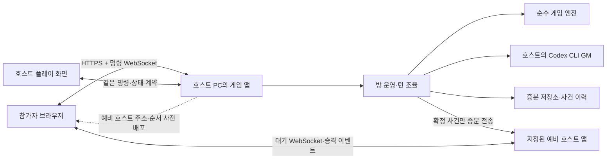

# 플레이어 호스팅 멀티플레이 인프라 설계안

Status: proposal
Date: 2026-09-27

관련 문서: [`docs/00_대전제.md`](../../docs/00_대전제.md) 2.1·2.4·2.5·8.5·9.3, [기존 GM 연결 스펙](../gm-connection/spec.md)

## 목적과 결정 범위

플레이어 한 명이 자기 PC에서 방을 연다. 참가자는 브라우저로 들어오며 호스트도 캐릭터를 맡아 플레이한다. 방의 게임 상태와 GM 실행 권한은 현재 호스트가 소유한다. 준비된 예비 호스트는 **변경 이력을 발생 순서대로** 받아 승계를 준비한다.

이 문서는 **구현 전 설계 제안**이다. 대전제의 `[제안]`을 `[확정]`으로 바꾸거나 기존 GM 연결 티켓의 상태를 변경하지 않는다. 합의 후 충돌하는 기존 스펙과 티켓을 갱신해야 한다.

### 이번 설계의 기준

- 호스트가 `방 만들기`를 누르면 게임 호스팅에 필요한 로컬 기능이 함께 시작된다. 별도의 중앙 게임 서버를 운영하거나 호스트에게 서버 명령을 따로 실행하게 하지 않는다. 내부 프로세스 수는 사용자 경험과 별개의 구현 선택이다.
- 게임 명령과 상태 방송은 **WebSocket**으로 처리한다. HTTP는 페이지·자산 제공과 초기 접속에 쓴다.
- 게임 상태의 원본은 호스트의 엔진이다. 브라우저와 섬 장면은 명령을 보내고 허용된 상태만 그린다.
- 참가자는 현재 화면에 필요한 공개 데이터만 구독하고 이후 공개 변경분을 순서대로 적용한다. 지정된 예비 호스트는 비공개 사건도 발생할 때마다 영속 기록한다. 방 전체를 복사하는 경로는 두지 않는다.
- **중앙 방 디렉터리나 중앙 게임 서버는 두지 않는다.** 호스트 후보의 접속 주소와 승계 순서를 현재 호스트가 미리 모든 참가자에게 배포한다.
- 정상 종료는 호스트의 명시적인 승계 이벤트로 처리한다. 갑작스러운 종료는 연결 종료 이벤트로 방을 멈추고, 예비 호스트의 명시적인 승격 명령으로 재개한다. 조용한 네트워크 장애가 감지되지 않으면 자동 승계를 주장하지 않는다.
- 상태 변화·준비·작업 완료는 publication·completion·readiness 이벤트 또는 명시적인 상태 전이로 한 번만 후속 작업을 시작한다. 반복 확인이나 임의 지연 재시도는 설계에 넣지 않는다.
- 2D·3D는 섬 장면의 표현 방식이다. 어느 쪽도 엔진의 상태 소유권이나 네트워크 계약을 바꾸지 않는다.

## 실행 구조



현재 호스트와 예비 호스트는 각각 자기 주소를 공개한다. 참가자는 주 호스트의 명령 WebSocket과 예비 호스트의 대기 WebSocket에 미리 연결한다. 예비 호스트 연결이 준비되고 현재 `eventSeq`까지 연속 반영했으며 참가자에게 현재 공개 `revision`까지 발행되면 방이 `ACTIVE`가 된다. 연결의 `open`·`close`, 예비 호스트의 `ready`, 저장소의 `committed`, GM 실행의 `completed`가 후속 작업을 구동한다. 외부 접속은 터널 또는 LAN 주소 제공자가 맡으며, 터널은 방 상태·호스트 선출을 관리하지 않는다.

호스트 앱은 한 번의 실행으로 Next.js 요청 처리와 `/ws` 업그레이드를 시작하는 Node 진입점을 쓴다. Next.js 사용자 정의 서버의 최적화·`standalone` 제약을 감수하고 해당 출력 모드는 사용하지 않는다. HTTP/전송 코드가 게임 규칙을 소유하지 않게 아래 모듈 인터페이스 뒤에 둔다.

## Clean Architecture 의존 방향

| 층 | 책임 | 의존할 수 있는 곳 |
|---|---|---|
| 도메인 (`engine`) | 이동·판정·상태 전이·도메인 이벤트. 영향받은 엔티티만 갱신하고 다른 참조는 재사용하는 규칙 | 자체 타입과 순수 유틸리티 |
| 애플리케이션 (`game`) | 방 생성·입장, 권한, 명령 직렬화, GM 턴 조율, 변경 이력 기록·복제, 호스트 이전 | 도메인과 아래 포트 인터페이스 |
| 포트 (`game` 내부) | `RoomStore`, `RoomPublisher`, `GMProvider`, `PeerRoster` 등 실제 외부 기능의 작은 인터페이스 | 도메인 타입 |
| 어댑터 (`host`) | WebSocket, 로컬 DB, Codex CLI·MCP, 섬 파일 로더, 호스트 후보 주소·복제 연결 | 애플리케이션 포트와 도메인 |
| 화면 (`web`) | 공용 플레이 틀, 섬 장면, 연결·재접속 표시, 명령 제출 | 공개 전송 계약(`protocol`) |

의존 방향은 `web/host → game → engine`이다. `engine`이나 `game`에서 Next.js, WebSocket, 파일 시스템, Codex CLI를 import하지 않는다. `protocol`은 브라우저와 호스트가 공유하는 **직렬화 가능한 메시지 계약**이며 내부 `EngineState`를 그대로 공개하지 않는다. 포트는 실제로 바꿀 필요가 있거나 도메인 동작을 검증해야 하는 곳에만 둔다. 아래 게임 모듈은 모두 `src/` 안에 둔다.

### 목표 코드 배치

```text
engine/                순수 규칙·상태 전이·이벤트
game/                  방 애플리케이션, 명령·턴 조율, 포트
host/                  호스트 실행 진입점, WebSocket·저장·GM 어댑터
protocol/              버전이 붙은 명령·응답·상태 메시지
web/                   Next.js 공용 화면과 섬별 장면 연결
schemas/               섬 데이터 스키마
islands/<섬_id>/        섬 데이터·gm.md·assets·web 장면
```

이는 `src/` 안의 모듈 목표 배치다. 현재 [`src/engine/src/movement.ts`](../../src/engine/src/movement.ts)의 순수 규칙은 유지하고, 파일 읽기·YAML 파싱이 섞인 [`src/engine/src/world.ts`](../../src/engine/src/world.ts)는 검증 규칙과 파일 어댑터로 나눈다. [`src/web/lib/play/session.ts`](../../src/web/lib/play/session.ts)의 전역 세션·하드코딩된 캐릭터·로그·가짜 GM·상태 투영은 방 애플리케이션으로 옮긴다. [`src/web/lib/play/provider.tsx`](../../src/web/lib/play/provider.tsx)의 공개 훅 모양은 유지하며 내부 전송만 바꾼다.

## 방과 상태 소유권

- 호스트 실행 인스턴스는 먼저 **활성 방 하나**를 소유한다. 저장된 캠페인은 여러 개를 둘 수 있어도 동시에 실행하는 방은 하나로 시작한다.
- 방 코어는 방 ID, 현재 호스트 세대(`term`), 전체 사건 번호(`eventSeq`), 공개 상태 개정 번호(`revision`), 현재 턴·입력 큐와 필요한 엔진 엔티티를 관리한다. 플레이어·캐릭터 소유권, 자원·인벤토리, 공개 로그, 비공개 GM 진행 정보와 처리한 명령 ID는 사건 이력에서 변경된 항목만 갱신하는 영속 투영에 둔다. 같은 값을 방 코어에 별도 복사해 보관하지 않는다.
- 상태 변경은 방의 단일 명령 큐에서 순서대로 처리한다. 명확한 이동은 엔진 판정 후 즉시 확정·방송하고, 도착 이벤트는 GM 큐에 넣는다. 플레이어 행동은 명시적인 `ready`·`pass`·호스트의 `proceed`로 모아 단일 GM 턴을 시작한다. 해당 턴의 시작 전이는 한 번만 일어나며, GM 완료 이벤트가 다음 턴을 연다. 시간 경과를 반복 확인하지 않는다.
- 모든 확정 변경은 먼저 영속 저장하고 `eventSeq`를 올린다. 공개 화면이 바뀌는 변경에만 공개 `revision`을 연속으로 올려 참가자에게 알린다. 두 이력은 같은 트랜잭션에서 기록한다. 임시 애니메이션 상태는 브라우저가 관리하며 방 상태에 포함하지 않는다.
- 방 상태는 `SYNCING`, `ACTIVE`, `PAUSED`, `HANDOFF` 사이에서 명시적으로 전이한다. 각 전이는 예상 이전 상태·`term`·이벤트 ID를 확인해 한 번만 확정한다. 저장 확정, 예비 호스트 준비, GM 완료, 연결 종료, 사용자 명령의 실제 이벤트가 해당 전이를 시작하며 중복 알림은 같은 전이를 다시 실행하지 않는다.
- 참가자는 권한과 현재 장면에 필요한 공개 범위만 구독한다. 각 범위의 엔티티·필드 변경분을 `revision` 순서대로 적용한다. 숨겨진 플래그, 미공개 섬 정보, GM 지침, 도구 토큰은 공개 변경분에 포함하지 않는다. 지정된 호스트 후보는 비공개 사건 이력을 별도 권한으로 수신한다.
- 호스트의 Codex 로그인 파일·토큰은 저장물·승계 메시지에 포함하지 않는다. 예비 호스트는 자기 PC의 호스트 앱, 동일한 섬 콘텐츠 버전, 자기 Codex 로그인이 있어야 한다.

### 영속 저장과 복제

로컬 저장소 어댑터는 **방이 시작된 뒤의 모든 확정 상태 변화 이력**을 `eventSeq` 순서로 영속 기록한다. 이력은 정상 플레이 중 삭제·절단하지 않는다. SQLite를 첫 후보로 둔다. 같은 트랜잭션에서 변경된 엔티티·필드의 현재 투영과 공개 `revision` 이력만 갱신한다. 시작·복구 때도 저장된 투영을 범위별로 읽거나 이력을 순차 적용하며 방 전체 스냅숏을 만들거나 복사하지 않는다. 전체 이력에는 엔진 변경, GM 도구 결과, 주사위 시드·결과, 명령 결과, 턴 전이와 호스트 이전 기록이 포함된다. 저장 포맷에는 `schemaVersion`, `contentHash`, `roomId`, `term`, 두 번호, 플레이어 소유권, GM 턴 상태가 들어간다. 실행 중인 `codex exec` 프로세스와 로그인 파일·토큰은 복제하지 않는다.

호스트는 예비 호스트가 마지막으로 영속 확인한 `eventSeq + 1`부터 **누락된 사건만** 순서대로 전송한다. 처음 참여한 예비 호스트도 이력의 시작부터 유한한 묶음으로 스트리밍하여 자기 저장소의 해당 엔티티·필드만 갱신한다. 이력을 하나의 메모리 객체나 전체 상태 사본으로 묶어 보내지 않는다. 예비 호스트가 연속 번호까지 영속 확인한 뒤에만 호스트가 해당 명령의 성공을 참가자에게 알린다. 예비 호스트가 없거나 복제가 끊기면 새 명령 접수를 멈추고 `PAUSED`를 공개한다. 다시 연결되면 실제 `open` 이벤트에서 마지막 확인 번호를 교환하고 누락 구간을 전송한다. 예비 호스트의 연속 번호 수신 확인이 현재 번호에 도달하면 `ready` 이벤트로 재개한다.

도구 호출이 진행되던 GM 턴에서 장애가 나면 새 호스트는 마지막 **확정된** 이벤트까지만 적용한다. 실행 중인 호출의 프로세스를 이어받으려 하지 않는다. 미완료 호출과 입력은 저장된 식별자를 기준으로 미처리 상태로 전이하고, 명시적인 재개 명령에서 처리한다. 명령 ID와 도구 호출 ID를 기록해 같은 변경이 두 번 적용되지 않게 한다.

## 전송 계약

WebSocket은 인증된 입장 뒤 양방향 메시지를 주고받는다. 클라이언트는 파티·현재 장면·보이는 지도·최근 로그처럼 화면에 필요한 공개 범위를 구독한다. 호스트는 구독 시점의 `revision`을 기준점으로 고정하고, 각 범위의 현재 엔티티·필드 값을 **유한한 묶음으로 순차 발행**한 뒤 그 사이에 확정된 변경분을 기준점 다음 번호부터 전달한다. 범위 발행이 끝났다는 `subscription_ready` 이벤트가 실제로 게시되면 화면을 한 번 전환한다. 과거 로그는 사용자가 요청한 구간만 읽는다. 연결의 `open`·`close` 또는 사용자의 재접속 명령이 연결 상태를 전이시키며, 임의 지연 재시도나 생존 확인 폴링은 두지 않는다. 조용한 연결 장애는 자동으로 감지·승계한다고 가정하지 않고, 화면에 명시적인 재연결·승격 조작을 제공한다. 전송 어댑터는 메시지 크기와 대기 버퍼를 제한한다. 모든 참가자는 예비 호스트 주소·승계 순서·`term`을 로컬에 보관한다.

| 방향 | 대표 메시지 | 필수 메타데이터 |
|---|---|---|
| 클라이언트 → 호스트 | `join`, `subscribe`, `move`, `act`, `ready`, `pass`, `claim_character`, `request_replay` | `protocolVersion`, `roomId`, `commandId`, 참가자 자격, 마지막 반영 `revision` |
| 호스트 → 클라이언트 | `scope_item`, `subscription_ready`, `state_changed`, `revision_advanced`, `log_added`, `turn_status`, `command_result`, `host_candidates`, `host_changing`, `replay_error` | `term`, `revision` 또는 번호 구간, 범위·엔티티 ID, 해당 명령 ID |
| 호스트 → 예비 호스트 | `committed_event`, `replica_ready`, `handoff_prepare`, `handoff_published` | 콘텐츠 해시, `term`, `eventSeq`, `revision`, 별도 예비 호스트 자격 |

방 코드는 **입장 비밀**이고 호스트 권한이 아니다. 캐릭터 소유권과 예비 호스트 자격은 별도 토큰·권한으로 확인한다. 서버는 클라이언트가 보낸 캐릭터 ID와 이동 대상을 그대로 믿지 않고 현재 방 상태에서 검증한다. 웹 클라이언트가 재전송한 `commandId`는 기존 결과를 돌려준다.

### 변경분 순서·누락 복구

번호는 TCP 패킷이 아니라 **서버가 확정한 논리적 상태 변경**마다 매긴다. 비공개 내용을 포함한 전체 이력에는 `eventSeq`, 모든 플레이어가 받는 공개 변경 이력에는 `revision`을 각각 연속으로 매긴다. 비밀 이벤트가 공개 번호에 빈칸을 만들면 플레이어가 재전송을 잘못 요구하거나 비밀의 존재를 추측할 수 있기 때문이다. 두 번호는 호스트가 바뀌어도 이어지며, `term`은 어느 호스트 세대가 보냈는지를 구분한다. 공개 변경분에는 `revision`, `previousRevision`, `eventId`, `term`, 영향받은 범위·엔티티 ID를 넣는다. 범위별 구독은 전역 공개 `revision` 순서를 유지한다. 구독 밖 변경이 여러 건 연속되면 호스트는 그 번호 구간을 내용 없는 `revision_advanced(fromRevision, toRevision)` 하나로 발행하고, 수신자는 `fromRevision = lastAppliedRevision + 1`일 때만 번호를 전진시킨다. 향후 플레이어별 비공개 화면이 생기면 수신 대상별 이력과 번호를 추가한다.

수신자는 `lastAppliedRevision`을 저장하고 다음 규칙을 따른다.

| 수신한 변경분 | 처리 |
|---|---|
| `revision = lastAppliedRevision + 1` | 반영하고 번호를 올린 뒤 보류 중인 다음 변경분을 순서대로 반영한다 |
| `revision <= lastAppliedRevision` | 이미 반영한 중복 메시지이므로 다시 적용하지 않는다 |
| `revision > lastAppliedRevision + 1` | 변경분을 **반영하지 않고** 제한된 버퍼에 보관한 뒤 그 빈 구간에 대해 `request_replay(fromRevision = lastAppliedRevision + 1, toRevision = revision - 1)`을 한 번 보낸다 |

예를 들어 1까지 반영했는데 4가 도착하면 4를 보류하고 2·3을 요청한다. 2가 도착하면 2만 반영하며, 3이 도착한 뒤에야 3과 보류한 4를 차례로 반영한다. 3이 오지 않았다면 4는 계속 반영하지 않는다. WebSocket 한 연결 안에서는 순서가 보장되지만, 재연결·호스트 이전·복제본 복구 사이의 빈틈을 이 규칙으로 검출한다.

호스트는 보관한 공개 변경 이력에서 **요청한 빈 구간만** 저장소 커서로 읽어 유한한 묶음으로 재전송한다. 구독 밖 번호는 이어진 범위로 압축해 알린다. 재접속자는 마지막으로 **반영한** 번호를 보내고 그 다음 번호부터 복구한다. 이미 같은 빈 구간을 요청 중이면 중복 요청하지 않는다. 버퍼가 차면 해당 구간 처리를 멈추고 전송 흐름 제어로 재개한다. 저장소 손상·프로토콜 버전 불일치로 정확한 이력을 읽을 수 없으면 `replay_error`를 게시하고 방을 일시 중단하여 명시적인 복구를 요구한다. 전체 상태 복사로 조용히 덮어쓰지 않는다. 예비 호스트는 승계 이력의 `eventSeq`에 같은 연속성 검사를 적용하고, 누락된 번호가 있는 동안 호스트로 승격하지 않는다. 예비 호스트의 수신 확인은 변경분을 영속 저장하고 연속 번호까지 반영한 뒤에만 보낸다. 새 호스트는 보관한 공개 이력으로 이전 호스트 시절의 누락분도 재전송한다.

## 호스트 이전

### 정상 종료

1. 예비 호스트가 준비 상태(호스트 앱 실행, 동일한 콘텐츠 해시, Codex 사용 가능, 참가자가 연결할 공개 주소 준비)를 알린다. 현재 호스트는 그 주소를 참가자에게 미리 배포한다.
2. 현재 호스트가 새 명령 접수를 멈춘다. 실행 중인 GM 턴의 실제 완료 이벤트 또는 명시적인 중단 전이를 받아 다음 단계로 간다.
3. 예비 호스트가 마지막 확인 번호 이후의 사건만 받아 영속 기록하고, 현재 `eventSeq`·`revision`까지 연속 반영했다는 `replica_ready`를 게시한다.
4. 이전 호스트가 쓰기 권한을 해제하고 `handoff_published`를 기록한다. 예비 호스트가 이를 받아 더 높은 `term`으로 승격한 뒤 대기 WebSocket에서 `promoted`를 게시한다.
5. 참가자는 이미 연결된 예비 호스트의 `promoted` 이벤트로 명령 대상만 전환하고, 마지막 공개 `revision` 이후 누락분만 요청한다.

이 과정에서 두 호스트가 동시에 명령을 확정하지 않도록 **현재 `term`의 호스트만 쓰기 권한**을 갖는다. 정상 이전은 기존 호스트와 새 호스트가 서로 승계 완료를 확인하므로 외부 조정자 없이 끝낼 수 있다.

### 갑작스러운 종료

지정된 예비 호스트가 끊김 없는 이력, 사전 배포된 공개 주소, 참가자와의 대기 연결을 갖고 있을 때 승계를 시도한다. 주 호스트 연결의 실제 `close` 이벤트를 받은 참가자는 입력을 멈춘다. 예비 호스트는 마지막 `eventSeq`·`revision`의 연속성과 승계 자격을 확인해 `promotion_available`을 게시한다. 예비 호스트 사용자의 명시적인 승격 명령이 오면 다음 `term`으로 방을 열고 `promoted`를 게시한다. 참가자는 이미 연결된 예비 호스트로 명령을 보내고 마지막 공개 `revision` 이후의 누락분만 받는다. 대기 연결까지 끊긴 참가자는 새 초대 주소를 방 밖 수단으로 받아야 한다.

중앙 조정자가 없으므로 **상태 복제만으로 자동 승계가 완성되지는 않는다.** 현재 호스트가 네트워크 일부와만 끊겼다면 두 호스트가 동시에 자신을 권위자로 오인할 수 있다. 현재 호스트는 각 확정 사건에 대해 예비 호스트의 영속 확인을 받아야 성공 응답을 내며, 확인 경로의 `close`가 발생하면 새 명령 접수를 멈춘다. 예비 호스트는 승격 전 이전 `term`의 사건 수신을 닫고 승격 후 이전 `term`의 쓰기를 거부한다. 다만 조용한 단절이나 이미 진행 중인 요청이 있으면 단일 권위를 자동으로 증명할 수 없다. 이 경우 방을 멈추고 사용자에게 명시적인 복구 결정을 요구한다. 임의의 네트워크 분리에서 무인 승계와 단일 권위자를 동시에 보장한다고 주장하지 않는다.

## 섬 장면과 GM

- 섬 팀은 `src/islands/<섬_id>/web/`에서 2D 또는 3D 장면을 만든다. 공개 인터페이스 `useGameState()`, `useMove()`, `useSendAction()`의 호출 방식은 유지한다. 훅의 내부 구현만 WebSocket 상태 구독·명령 전송으로 교체한다.
- 섬 장면은 자기만의 카메라·애니메이션·렌더링 상태를 가질 수 있다. 엔진 위치·플래그·전투·보상은 호스트의 명령 결과로만 바뀐다. 실시간 3D 자유 이동을 도입하려면 위치·충돌·동기화 규칙을 별도로 합의해야 한다.
- 호스트 앱은 `gm.md`와 해당 턴에 필요한 상태만 읽어 GM 입력을 만든다. `GMProvider` 포트와 호스트의 `CodexCliProvider` 어댑터를 사용하고, MCP 도구는 현재 호스트의 열려 있는 턴에만 연결한다. 실제 GM 완료 콜백이 해당 턴의 확정 절차를 한 번 시작한다.
- 호스트 이전 중에는 새 GM 턴을 시작하지 않는다. 새 호스트의 자체 Codex 로그인으로 다음 턴을 실행한다.

## 기존 설계와의 차이·변경 순서

현재 [GM 연결 스펙](../gm-connection/spec.md)과 티켓 04·05·07은 SSE 상태 방송, 콘솔 방 코드, 수동 서버·터널 실행, 4초 행동 모음 창을 전제한다. 이번 제안이 채택되면 WebSocket, 화면의 `방 만들기`, 한 번 실행되는 호스트 앱, 명시적인 `ready`·`pass`·`proceed` 전이로 바꾼다. GM 턴·MCP 도구·섬 공개 훅의 계약은 이어 쓴다. 대전제의 `[제안]` 내용은 팀 합의 전까지 확정으로 바꾸지 않는다.

| 단계 | 작업 | 완료 기준 |
|---|---|---|
| 1. 방 코어 분리 | `session.ts`의 상태와 규칙을 `Room` 애플리케이션으로 옮기고 공개/비공개 범위의 변경분 생성을 분리 | 브라우저나 Next 없이 방에 명령을 넣어 같은 엔진 결과를 얻고, 영향받은 엔티티만 갱신한다 |
| 2. 저장 | 전체 이력의 추가 기록, 공개 이력 분리, 범위별 투영, 스키마 버전, 명령 중복 제거 | 재시작 후 필요한 범위만 복원하고 오래된 `revision`부터 누락 구간을 스트리밍한다 |
| 3. 실시간 연결 | 버전 있는 WebSocket 계약, 입장·캐릭터 소유권, 범위별 증분 발행, 변경분 번호·재전송 | 두 브라우저가 같은 상태를 보며, 1 다음 4를 받으면 2·3을 복구하기 전 4를 반영하지 않는다 |
| 4. GM 통합 | 기존 GM 스펙의 턴 큐·Codex·MCP를 `Room`에 연결하고 준비·완료 이벤트로 턴을 전이 | 행동과 도구 호출이 한 번만 확정되고 모두에게 같은 결과가 보인다 |
| 5. 정상 호스트 이전 | 예비 호스트 앱 준비·주소 사전 배포·누락 이력 증분 복제·일시 중단·승계 | 새 호스트가 이전 호스트 시절의 누락 변경분까지 재전송하며 같은 방을 이어서 플레이한다 |
| 6. 장애 복구 | 준비된 예비 호스트의 명시적인 승격·대기 연결 전환·불확실할 때 일시 중단 | 호스트 프로세스 강제 종료 후 마지막 연속 확인 `eventSeq`에서 진행하거나, 충돌 가능성이 있으면 멈춘다 |

## 검토가 필요한 결정

1. **호스트 후보의 설치 범위**: 일반 참가자는 브라우저만 있으면 되지만, 호스트 후보는 로컬 앱·같은 콘텐츠·자기 Codex 로그인이 필요하다. 모든 참가자를 후보로 만들지, 명시적으로 지원자를 지정할지 정한다. 이 설계는 지정된 예비 호스트 한 명을 기본값으로 둔다.
2. **공개 주소 제공**: 터널·LAN 연결을 어댑터 뒤에 둔다. 예비 호스트도 승계 전에 외부에서 닿는 주소를 확보해야 한다. 제품에서 이를 자동 설정할 수 있는 방식과 배포 형태는 별도 기술 검증으로 정한다.

## 참고

- [Next.js 사용자 정의 서버](https://nextjs.org/docs/app/guides/custom-server): 한 진입점에 Next.js 요청 처리를 붙일 수 있으나 최적화·`standalone` 제약이 있다.
- [WebSocket 프로토콜 RFC 6455](https://www.rfc-editor.org/rfc/rfc6455.html): 브라우저와 호스트 사이의 양방향 연결.
- [Cloudflare WebSockets](https://developers.cloudflare.com/network/websockets/), [Cloudflare Tunnel](https://developers.cloudflare.com/tunnel/): 터널 경유 연결과 끊김·재접속 고려 사항.
